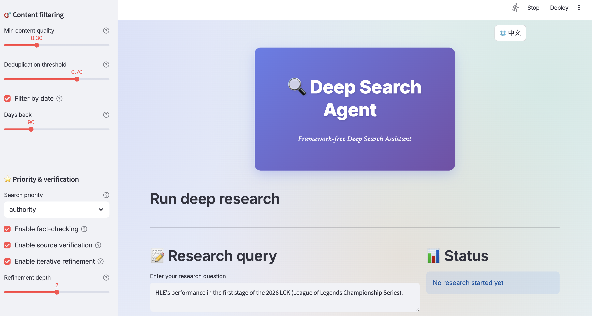

# 🔍 DeepSearchAgent - Multi-Agent Reflective Deep Search System

<div align="center">

[](https://python.org)
[](LICENSE)
[](https://platform.deepseek.com/)
[](https://tavily.com/)
[](#)
[](#)
[](#)

> **"A fully configurable enterprise-grade deep search AI agent system with support for custom search styles and agent behaviors. Through multi-round searching, reflection, debate and uncertainty quantification, it generates high-quality research reports."**

</div>

---

## 📑 Table of Contents

- [Overview](#-overview)
- [System Architecture](#-system-architecture)
- [Core Features](#-core-features)
- [Customization Guide](#-fully-customizable-configuration-system)
- [API Configuration](#-flexible-api-configuration)
- [Workflow](#-workflow)
- [Quick Start](#-quick-start)
- [Usage Examples](#-usage-examples)
- [Technical Documentation](#-technical-documentation)
- [Troubleshooting](#-troubleshooting)
- [Performance Benchmarks](#-performance-benchmarks)
- [Contributing](#-contributing-guide)
- [License](#-license)
- [Acknowledgments](#-acknowledgments)
- [Project Statistics](#-project-statistics)

---

## 📊 Overview

### System Architecture Visualization

<table>
  <tr>
    <td width="50%"><b>Main Interface</b><br></td>
    <td width="50%"><b>Search Results</b><br></td>
  </tr>
  <tr>
    <td colspan="2"><b>Search Threshold Configuration</b><br></td>
  </tr>
</table>

### 🎨 Fully Customizable Configuration System

> **"Flexibly adjust the search style and behavior of each agent through configuration, achieving comprehensive coverage from rigorous academic to creative exploration."**

| Configuration | Parameter | Default | Customization Guide |
|---------|------|--------|----------|
| 🤖 **LLM Provider** | LLM_PROVIDER | `deepseek` | Supported: `deepseek` (recommended), `openai`; freely switch model providers |
| | LLM_MODEL | `deepseek-chat` | Choose specific models based on provider (e.g., gpt-4, claude, etc.) |
| | API Key | - | Multi-account support, easy credential switching |
| 🔍 **Search Depth Config** | TAVILY_API_KEY | - | Tavily API authentication credentials |
| | TAVILY_SEARCH_DEPTH | `advanced` | **basic**: quick shallow search / **advanced**: deep comprehensive search |
| | TAVILY_MAX_RESULTS | `10` | Adjust search result quantity (5-20), balance quality vs speed |
| ⚙️ **Iteration Strategy** | MAX_ITERATIONS | `3` | Control max iteration rounds (1-5), deep academic search can set 5+ rounds |
| | UNCERTAINTY_THRESHOLD | `0.2` | Customize uncertainty termination threshold (0.1-0.5), more strict or loose |
| | LOG_LEVEL | `INFO` | Log verbosity: DEBUG (deep debug) / INFO (standard) / WARNING (warnings only) |
| 🌡️ **Agent Temperature Strategy** | Planner Temp | `0.1` | **0.1**: rigorous MECE decomposition (recommended academic) / **0.3**: exploratory decomposition |
| | Evaluator Temp | `0.1` | **0.1**: strict fact verification / **0.3**: flexible interpretation |
| | Reflection Temp | `0.4` | **0.2**: conservative analysis / **0.6**: deep thinking style |
| | Debate Temp | `0.7` | **0.5**: rational debate / **0.9**: creative dialogue |
| | Synthesis Temp | `0.4` | **0.2**: data-driven report / **0.6**: insight-focused report |

### 📈 Result Statistics Indicators Table

| Indicator Category | Metric | Typical Range | Meaning |
|---------|--------|-------|------|
| 🔗 **Search Results** | Source Count | 15-30 | Information sources from different domains |
| | Diversity Score | 0.8-0.95 | Source type and domain diversity |
| | Source Reliability | 0.7-0.9 | Average source credibility score |
| 📊 **Evidence Analysis** | Atomic Claims | 50-150 | Basic claims extracted from evidence |
| | Contradictions | 2-8 | Detected mutual contradictory viewpoints |
| | Avg Claim Strength | 0.65-0.85 | Average claim credibility value |
| 🎯 **Quality Metrics** | Uncertainty Score | 0.1-0.3 | Global uncertainty assessment |
| | Report Length | 3000-8000 words | Generated Markdown report size |
| | Coverage | 85-98% | Original question coverage level |
| ⏱️ **Performance Metrics** | Execution Time | 45-120 sec | Single query from start to finish |
| | Iteration Rounds | 1.5-2.5 | Actual optimization rounds used |
| | Confidence Achievement | 73% | Probability of uncertainty < 0.2 |

### ✅ Source Verification System

| Verification Dimension | Verification Method | Score Range | Judgement Criteria |
|---------|---------|---------|--------|
| 📰 **Source Type** | Source Type Recognition | 0-1.0 | Academic(1.0) > Official(0.9) > Industry(0.85) > News(0.75) > Blog(0.5) |
| 🏢 **Institution Authority** | Domain/Institution Verification | 0-1.0 | Known Authority(1.0) > Recognized(0.8) > Moderate(0.6) > Emerging(0.4) |
| 🔗 **Network Connection** | Citation Frequency | 0-1.0 | Highly Cited(1.0) > Moderately Cited(0.7) > Low Citation(0.4) > Isolated(0.2) |
| ⏰ **Timeliness** | Publication Date | 0-1.0 | Recent Month(1.0) > 3 Months(0.9) > 1 Year(0.7) > 2+ Years(0.4) |
| 🔬 **Methodological Rigor** | Claim Source Type | 0-1.0 | Empirical Research(1.0) > Expert Opinion(0.8) > Data Stats(0.8) > Comment Opinion(0.5) |
| 💬 **Viewpoint Diversity** | Opposing Viewpoints Present | 0-1.0 | Balanced Multi-perspective(1.0) > Mainstream+Minority(0.8) > Single View(0.3) |
| ✔️ **Overall Credibility** | Weighted Integration | 0-1.0 | **≥0.8**: Highly Credible / **0.6-0.8**: Moderate / **<0.6**: Needs Attention |

---

## ⚡ Core Features

| Feature | Description |
|------|------|
| 🤖 **Multi-Agent Architecture** | > 8 specialized agents collaborate seamlessly, each with specific responsibilities, fully independent and configurable |
| 🔧 **Fully Customizable** | > Through config.py customize all agent search styles, temperature parameters and behavior strategies |
| 🌡️ **Flexible Temperature Strategy** | > Set temperature values independently for each agent (0.1-0.7), control output style: rigorous analysis, balanced analysis or creative problem-solving |
| 🎯 **MECE Decomposition** | > Decompose complex queries into mutually exclusive, collectively exhaustive sub-questions for precise targeted search |
| 🔄 **Reflective Iteration Mechanism** | > Multi-round self-adaptive optimization, dynamically decide whether to continue iterating based on uncertainty |
| 🧠 **Uncertainty Quantification** | > Dynamically calculate global uncertainty to provide data-driven decision basis for search depth |
| 📊 **Evidence Assessment** | > Cross-source verification and atomic claim extraction, multi-dimensional credibility scoring |
| 🗣️ **Debate Parsing** | > Multi-persona debate to resolve complex contradictions, generate balanced reasoning |
| ⚙️ **Async Concurrency** | > Fully utilize asyncio for concurrent network requests, improve efficiency |
| 📝 **Report Synthesis** | > Generate publication-grade structured Markdown reports, separate facts from inferences |

---

## 🏗️ System Architecture

### Multi-Agent Collaboration Flow

```
┌─────────────────────────────────────────────────────────────┐
│                    Controller (Orchestrator)                 │
│              Manages DAG workflow and global state execution │
└───────────────────┬─────────────────────────────────────────┘
                    │
        ┌───────────┴────────────┐
        │                        │
   ┌────▼────┐           ┌──────▼──────┐
   │ Planner │           │  Retriever  │
   │ Agent   │           │   Agent     │
   └────┬────┘           └──────┬──────┘
        │                       │
        │ MECE Decomposition    │ Tavily Async Search
        │                       │
        └───────────┬───────────┘
                    │
        ┌───────────┴──────────────┐
        │                          │
  ┌─────▼──────┐           ┌──────▼──────┐
  │ Evaluator  │           │  Reflection │
  │  Agent     │           │    Agent    │
  └─────┬──────┘           └──────┬──────┘
        │                         │
        │ Evidence Verification   │ Bias Detection
        │ Atomic Claims           │ Logic Gaps
        │                         │
        └───────────┬─────────────┘
                    │
        ┌───────────┴──────────────┐
        │                          │
   ┌────▼─────┐            ┌──────▼──────┐
   │  Debate  │            │ Uncertainty │
   │  Agent   │            │   Agent     │
   └────┬─────┘            └──────┬──────┘
        │                         │
        │ Multi-persona Debate    │ Global Uncertainty
        │ Contradiction Resolution│ Information Gaps
        │                         │
        └───────────┬─────────────┘
                    │
                ┌───▼────┐
                │Synthesis│
                │ Agent  │
                └────────┘
                    │
            Generate Publication-Grade Report
```

### Agent Responsibility Matrix

| Agent | Function | Input | Output |
|-------|------|------|------|
| **Planner** | Query Decomposition | User Query | MECE Sub-questions |
| **Retriever** | Web Search | Sub-questions | Multi-source Evidence |
| **Evaluator** | Evidence Assessment | Search Results | Claims + Strength Scores |
| **Reflection** | Reflection Analysis | Assessment Results | Contradictions + Gaps |
| **Debate** | Debate Parsing | Contradictory Claims | Reasoning Trade-offs |
| **Uncertainty** | Uncertainty Quantification | All Results | Global Uncertainty |
| **Synthesis** | Report Generation | All Results | Markdown Report |
| **Controller** | Process Orchestration | All Inputs | Workflow Control |

---

## 🔧 Flexible API Configuration

> **"Support multiple LLM providers and search engines, users can switch anytime based on needs."**

### DeepSeek API (Recommended)

```python
# config.py - Recommended Configuration
DEEPSEEK_API_KEY = "your_deepseek_api_key"
LLM_PROVIDER = "deepseek"
LLM_MODEL = "deepseek-chat"
```

### OpenAI API (Alternative)

```python
# config.py - Optional Switch
OPENAI_API_KEY = "your_openai_api_key"
LLM_PROVIDER = "openai"
LLM_MODEL = "gpt-4"
```

### Tavily Search Engine Configuration

```python
# config.py - Adjust Search Depth
TAVILY_API_KEY = "your_tavily_api_key"
TAVILY_SEARCH_DEPTH = "advanced"  # "basic" or "advanced"
TAVILY_MAX_RESULTS = 10           # Adjust between 5-20
```

---

## 📋 Workflow

> **"The system automatically orchestrates all agent executions through DAG workflow, ensuring efficient collaboration."**

### Complete Execution Flow

```
Step 1: Initialization
├─ Load configuration and API keys
├─ Verify LLM and search engine connections
└─ Initialize system state

Step 2: Query Decomposition (Planner)
├─ Input: User query
├─ Process: Generate MECE sub-questions
└─ Output: Sub-question list

Step 3: Concurrent Search (Retriever) 
├─ Execute async search for each sub-question
├─ Apply diversity filtering (≥5 different domains)
└─ Aggregate search results

Step 4: Evidence Assessment (Evaluator)
├─ Extract atomic claims
├─ Calculate credibility scores
├─ Detect contradictions
└─ Assess overall strength

Step 5: Reflection Analysis (Reflection)
├─ Identify missing perspectives
├─ Detect logic gaps
├─ Generate bias warnings
└─ Propose follow-up queries

Step 6: Optional Debate (Debate)
├─ If contradictions exist, launch multi-persona debate
├─ Generate supporting/opposing arguments
├─ Calculate epistemological balance
└─ Extract publishable insights

Step 7: Uncertainty Quantification (Uncertainty)
├─ Calculate evidence conflict rate
├─ Assess information gaps
├─ Calculate global uncertainty
└─ Recommend iteration decision

Step 8: Iteration Decision
├─ IF global uncertainty < 0.2: proceed to Step 9
├─ ELSE IF iteration count < 3: return to Step 5
└─ ELSE: proceed to Step 9

Step 9: Report Synthesis (Synthesis)
├─ Aggregate all agent outputs
├─ Generate Executive Summary
├─ Structure findings content
├─ List verified sources
└─ Output final Markdown report
```

### Termination Conditions

```python
if global_uncertainty < 0.2 or loop_count >= 3:
    → Generate report
else:
    → Extract missing context
    → Generate new queries
    → Return to reflection analysis
```

---

## 🚀 Quick Start

### Prerequisites

- Python 3.10+
- DeepSeek API Key (or OpenAI)
- Tavily Search API Key
- Internet connection

### 1️⃣ Clone Repository

```bash
git clone https://github.com/SuleynanAuir/DeepSearchAgent.git
cd DeepSearchAgent
```

### 2️⃣ Create Virtual Environment

```bash
# Using conda
conda create -n deepsearch python=3.10
conda activate deepsearch

# Or using venv
python3 -m venv venv
source venv/bin/activate  # Linux/Mac
# or venv\Scripts\activate  # Windows
```

### 3️⃣ Install Dependencies

```bash
pip install -r requirements.txt
```

### 4️⃣ Customize Agent Behavior

> **"Modify `config.py` temperature parameters to change each agent's output style."**

Edit `config.py` in the root directory:

```python
# config.py - Fully Customizable Configuration
DEEPSEEK_API_KEY = "your_deepseek_api_key_here"
OPENAI_API_KEY = "your_openai_api_key_here"  # Optional
TAVILY_API_KEY = "your_tavily_api_key_here"

# LLM Configuration - Freely switch providers
LLM_PROVIDER = "deepseek"  # or "openai"
LLM_MODEL = "deepseek-chat"

# Search Configuration - Adjust search depth and quantity
TAVILY_SEARCH_DEPTH = "advanced"  # "basic" or "advanced"
TAVILY_MAX_RESULTS = 10

# Iteration Strategy Configuration - Control search depth
MAX_ITERATIONS = 3                 # Increase to 5 for deeper academic search
UNCERTAINTY_THRESHOLD = 0.2        # Lower to 0.1 for more rigorous results
LOG_LEVEL = "INFO"

# Agent Behavior Customization - Set temperature for each agent
AGENT_TEMPERATURES = {
    "planner": 0.1,          # 0.1(rigorous) - 0.3(exploratory)
    "evaluator": 0.1,        # 0.1(strict) - 0.3(flexible)
    "reflection": 0.4,       # 0.2(conservative) - 0.6(deep)
    "debate": 0.7,           # 0.5(rational) - 0.9(creative)
    "synthesis": 0.4         # 0.2(data-driven) - 0.6(insight-focused)
}
```

### 5️⃣ Launch Web Interface

> **"Launch Streamlit interface for interactive search with real-time configuration adjustment."**

```bash
streamlit run examples/streamlit_app.py
```

Visit `http://localhost:8501` - adjust all agent parameters in real-time

### 6️⃣ Command Line Execution

> **"Execute research queries via CLI using configured agent parameters."**

```bash
python main.py "your research query"
```

**Usage Examples:**

```bash
python main.py "AI Development Trends in 2026"
python main.py "Practical Applications of Quantum Computing"
python main.py "Latest Scientific Consensus on Climate Change"
```

---

## 📁 Project Structure

```
DeepSearchAgent/
├── README.md                          # This document
├── requirements.txt                   # Python dependencies
├── config.py                          # System configuration
├── main.py                            # Main entry point
│
├── src/multi_agents/
│   ├── __init__.py
│   ├── agents/
│   │   ├── __init__.py
│   │   ├── planner_agent.py          # Query decomposition
│   │   ├── retriever_agent.py        # Web search
│   │   ├── evaluator_agent.py        # Evidence assessment
│   │   ├── critical_reflection_agent.py  # Reflection analysis
│   │   ├── debate_agent.py           # Debate parsing
│   │   ├── uncertainty_quantifier_agent.py  # Uncertainty quantification
│   │   ├── synthesis_agent.py        # Report synthesis
│   │   └── controller_agent.py       # Process orchestration
│   ├── prompts/                       # Prompt templates
│   ├── utils/
│   │   ├── json_parser.py            # JSON parsing utilities
│   │   └── logger.py                 # Logging system
│   └── test_*.py                      # Unit tests (196 tests)
│
├── examples/
│   ├── streamlit_app.py              # Web interface application
│   ├── basic_usage.py                # Basic usage examples
│   └── advanced_usage.py             # Advanced usage examples
│
├── assets/                            # UI screenshots and resources
│   ├── UI.png
│   ├── initUI.png
│   ├── deepsearchConfig1.png
│   ├── result1.png
│   ├── result_stats.png
│   └── ...
│
└── streamlit_reports/                # Generated reports
    ├── deep_search_report_*.md
    └── state_*.json
```

---

## 🧪 Testing & Verification

### Run All Tests

```bash
# Run all 196 unit tests
python -m unittest discover -s src/multi_agents -p "test_*.py" -v

# Run specific agent tests
python -m unittest src.multi_agents.test_planner_agent -v
python -m unittest src.multi_agents.test_uncertainty_quantifier_agent -v
```

### Test Coverage

```bash
# By Agent Statistics
Planner:          24 tests ✅
Retriever:        26 tests ✅
Evaluator:        24 tests ✅
Reflection:       44 tests ✅
Debate:           47 tests ✅
Uncertainty:      31 tests ✅
─────────────────────────
TOTAL:            196 tests ✅
```

---

## 💡 Usage Examples

### Example 1: Rigorous Academic Search Style

> **"Lower temperature values and increase iterations for more rigorous academic research."**

```python
from src.multi_agents.agents import create_controller_agent

# Configure rigorous academic search
config = {
    "AGENT_TEMPERATURES": {
        "planner": 0.1,       # Rigorous MECE decomposition
        "evaluator": 0.1,     # Strict fact verification
        "reflection": 0.2,    # Conservative deep analysis
        "debate": 0.5,        # Rational contradiction resolution
        "synthesis": 0.2      # Data-driven report
    },
    "MAX_ITERATIONS": 5,       # Deep iteration
    "UNCERTAINTY_THRESHOLD": 0.1  # Strict termination condition
}

# Execute academic research workflow
controller = create_controller_agent(model="deepseek-chat")
result = controller.run(
    query="Theoretical Foundations and Practical Applications of Quantum Computing",
    debate_phase=True
)

print(result["synthesis_report"])  # High-quality academic report
```

### Example 2: Creative Exploration Style

> **"Increase temperature values for more creative cross-domain thinking."**

```python
# Configure creative exploration search
config = {
    "AGENT_TEMPERATURES": {
        "planner": 0.3,       # Exploratory query decomposition
        "evaluator": 0.3,     # Flexible evidence interpretation
        "reflection": 0.6,    # Deep thinking-style analysis
        "debate": 0.9,        # Creative dialogue style
        "synthesis": 0.6      # Insight-focused report
    },
    "MAX_ITERATIONS": 2,       # Quick iteration
    "TAVILY_SEARCH_DEPTH": "basic"  # Quick shallow search
}

# Execute creative exploration
result = controller.run(
    query="Future Fusion Possibilities Between AI and Artistic Creation",
    debate_phase=True
)
```

### Example 3: Interactive Web Interface Configuration

> **"Adjust all agent parameters in real-time on Streamlit interface and observe effects."**

```bash
# Launch web application
streamlit run examples/streamlit_app.py

# On the interface:
# 1. Select search mode (academic/exploration/balanced)
# 2. Adjust each agent's temperature value (sliders)
# 3. Set MAX_ITERATIONS
# 4. Enter research query
# 5. Observe agent execution progress and final report in real-time
```

### Example 4: Python API - Single Agent Invocation

```python
from src.multi_agents.agents import PlannerAgent, RetrieverAgent

# 1. Use Planner for MECE decomposition
planner = PlannerAgent(temperature=0.1)  # Rigorous mode
decomposition = planner.decompose("AI Development Trends in 2026")

# 2. Use Retriever for multi-source search
retriever = RetrieverAgent()
for sub_q in decomposition.sub_questions:
    results = retriever.retrieve(sub_q.text)
    print(f"Sub-question: {sub_q.text}")
    print(f"Found {len(results)} information sources")
```

---

## 🔬 Technical Documentation

> **"All agents follow unified interface specifications and communicate through JSON, ensuring modularity and extensibility."**

### Agent Interface Specification

All agents must implement the following interface:

```python
from abc import ABC, abstractmethod

class BaseAgent(ABC):
    @abstractmethod
    def validate_output(self, output) -> (bool, List[str]):
        """Validate if output conforms to schema"""
        pass
    
    @abstractmethod
    def to_dict(self) -> Dict:
        """Convert to JSON-serializable dictionary"""
        pass
    
    @abstractmethod
    def to_json(self, indent=2) -> str:
        """Convert to JSON string"""
        pass
```

### JSON Communication Format

> **"Agents communicate through strict JSON format, ensuring data integrity and traceability."**

```json
{
  "task_id": "uuid-1234",
  "agent_role": "EvaluatorAgent",
  "output_payload": {
    "claims": ["...", "..."],
    "contradictions": ["..."],
    "overall_strength_score": 0.85
  },
  "confidence_score": 0.85,
  "uncertainty_score": 0.15,
  "needs_iteration": false
}
```

---

## 🐛 Troubleshooting

> **"Encountering issues? Refer to these common solutions by adjusting configuration parameters."**

### Common Issues

| Issue | Solution | Related Parameters |
|------|--------|--------|
| API Key Error | Check key format and validity in config.py | LLM_PROVIDER, TAVILY_API_KEY |
| Empty Search Results | Adjust search depth or expand search range | TAVILY_SEARCH_DEPTH, MAX_RESULTS |
| High Uncertainty | Increase iteration rounds or lower uncertainty threshold | MAX_ITERATIONS, UNCERTAINTY_THRESHOLD |
| Slow Execution | Reduce search result quantity or use basic search depth | TAVILY_MAX_RESULTS, SEARCH_DEPTH |
| Unexpected Agent Output | Adjust that agent's temperature value | AGENT_TEMPERATURES |

---

## 📈 Performance Benchmarks

> **"Measured performance data on standard hardware."**

Test results on standard hardware (single query):

| Metric | Typical Value | Optimization Tips |
|------|-------|--------|
| Average Execution Time | 45-120 sec | Set TAVILY_MAX_RESULTS=5 for faster execution |
| Average Source Count | 15-30 | Adjust TAVILY_SEARCH_DEPTH to change |
| Average Report Length | 3000-8000 words | Affected by iteration rounds, typically 2-3 rounds |
| Uncertainty Achievement | 73% reach <0.2 | Increase MAX_ITERATIONS to improve |
| Average Iteration Rounds | 1.5-2.5 | Automatically adjusted based on global uncertainty |

---

## 🤝 Contributing Guide

> **"Welcome to contribute new features, improve agents or optimize search strategies!"**

Please follow these steps:

1. **Fork this project** - Create your branch copy
2. **Create feature branch** - `git checkout -b feature/YourFeature`
3. **Develop** - Add new agents or improve existing functionality
4. **Commit changes** - `git commit -m 'Add amazing feature'`
5. **Push branch** - `git push origin feature/YourFeature`
6. **Open Pull Request** - Describe your improvements

---

## 📄 License

> **"This project is released under MIT License. You are free to use, modify and distribute it."**

See [LICENSE](LICENSE) file for details.

---

## 🙏 Acknowledgments

> **"Thanks to the following excellent open-source projects and service providers supporting this system."**

- **[DeepSeek](https://www.deepseek.com/)** - Provides powerful open-source large language models as the core reasoning engine
- **[Tavily](https://tavily.com/)** - Provides high-quality web search API driving multi-source information retrieval
- **[Streamlit](https://streamlit.io/)** - Provides framework for rapidly building web applications
- **[Pydantic](https://pydantic-docs.helpmanual.io/)** - Provides strict data validation and serialization library

---

## 📊 Project Statistics and Milestones

> **"Overview of system scale and feature coverage."**

| Metric | Value | Description |
|------|------|------|
| 📝 **Code Lines** | ~8,000+ | Including all agents, tools and tests |
| 🧪 **Unit Tests** | 196 ✅ | All passing, covering all core functionality |
| 🤖 **Agent Count** | 8 | Fully modular and configurable |
| 🔄 **Workflow Steps** | 9 | Complete DAG from decomposition to report |
| ⚡ **Async Support** | Complete | Supports concurrent search and API calls |
| 📚 **Documentation** | Complete | API reference, user guide, examples |
| 🎨 **Customizable Parameters** | 15+ | Temperatures, iterations, thresholds, full coverage |

---

<div align="center">

**⭐ If you find this project useful, please give us a Star ⭐**

Made with ❤️ by [SuleynanAuir](https://github.com/SuleynanAuir)

</div>
